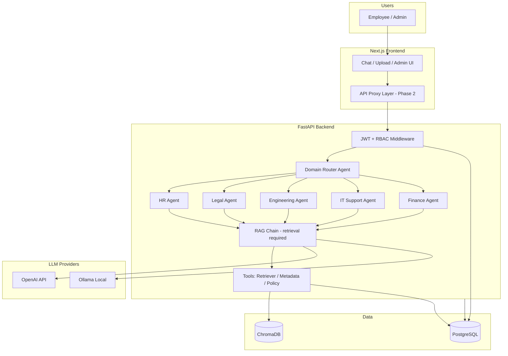
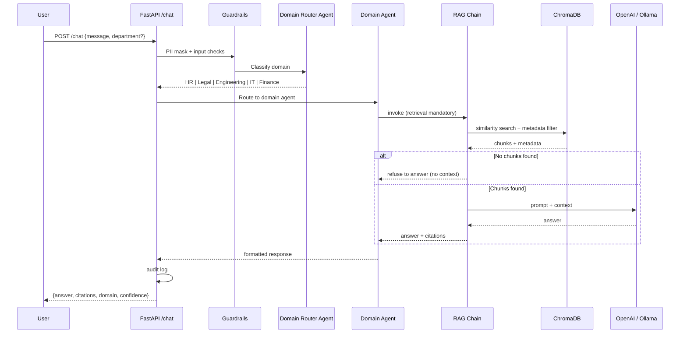
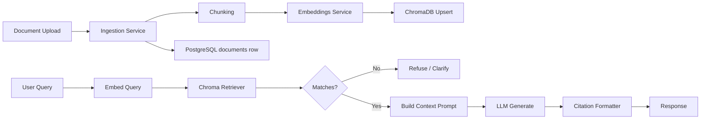
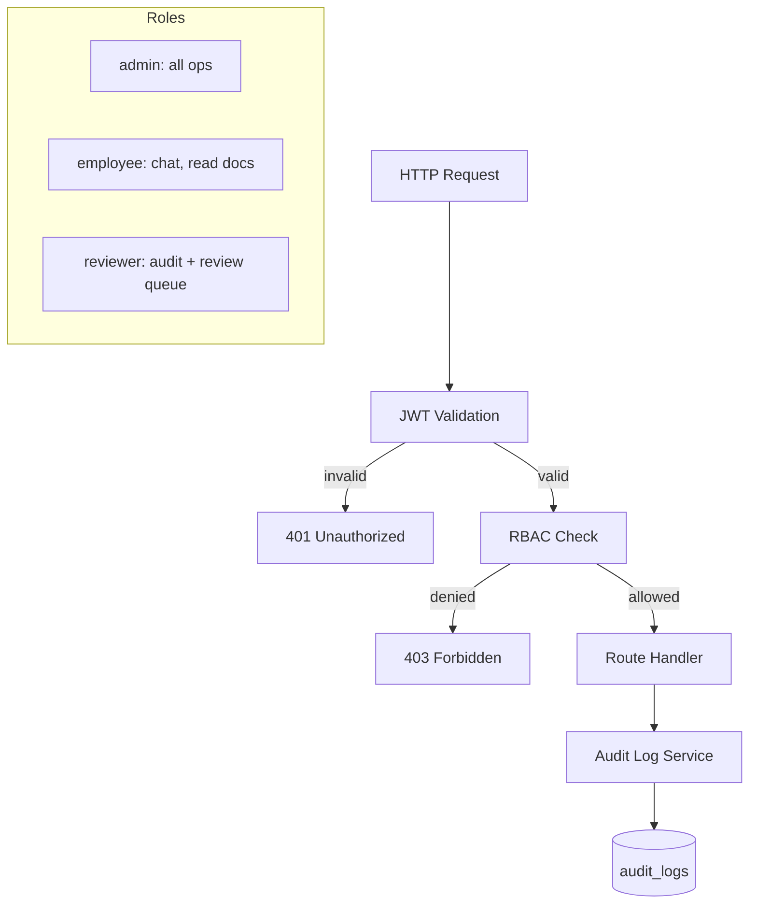

# Enterprise Knowledge Bot — Architecture

## Assessment: Extend In-Place vs New Backend

| Aspect | Existing Next.js App | Phase 1 Decision |
|--------|---------------------|------------------|
| Frontend | Next.js 16 + React 19, chat/upload/admin UI | **Keep** — proxy to FastAPI in Phase 2 |
| Auth | Supabase Auth + RLS | **Migrate** to JWT + RBAC in FastAPI (Phase 2 frontend wiring) |
| Vector search | Supabase pgvector (`match_document_chunks`) | **ChromaDB** (default) with metadata filtering |
| Relational data | Supabase PostgreSQL schema | **Standalone PostgreSQL** via SQLAlchemy |
| Agents | Single LangChain agent in `lib/agent/` | **Multi-agent router** in `backend/agents/` |
| Connectors | SharePoint, Confluence, URL | **Keep in Next.js** until Phase 2 ingestion port |

**Decision:** Add `backend/` FastAPI service alongside the existing Next.js app. Do not delete working Next.js features. Phase 2 wires the frontend to FastAPI and optionally deprecates Supabase API routes.

---

## System Architecture



---

## Multi-Agent Router Flow



**Domain routing rules (Phase 1):**
- Keyword + LLM classification via `agents/router.py`
- Each domain agent inherits base RAG behavior with domain-specific system prompts
- Retrieval is **always** invoked before generation; empty retrieval → canned "no documents" response

---

## RAG Pipeline Flow



**Metadata stored per chunk:** `document_id`, `title`, `source`, `department`, `owner`, `version`, `sensitivity_level`, `last_updated`

---

## Security & RBAC Flow



| Role | chat | upload | reindex | documents | audit-logs |
|------|------|--------|---------|-----------|------------|
| employee | ✓ | ✓ (own dept) | ✗ | read (dept) | own only |
| reviewer | ✓ | ✓ | ✓ | read all | read all |
| admin | ✓ | ✓ | ✓ | full | full |

---

## Folder Structure

```
EnterpriseKnowledgeBot/
├── ARCHITECTURE.md          # This document
├── docker-compose.yml
├── .env.example
├── backend/
│   ├── app.py               # FastAPI entry
│   ├── config.py            # Settings from env
│   ├── dependencies.py      # DI: db, auth, chroma
│   ├── requirements.txt
│   ├── Dockerfile
│   ├── routers/
│   │   ├── auth.py          # login, register
│   │   ├── chat.py          # POST /chat
│   │   ├── upload.py        # POST /upload
│   │   ├── documents.py     # GET /documents, POST /reindex
│   │   ├── audit.py         # GET /audit-logs
│   │   └── health.py        # GET /health
│   ├── agents/
│   │   ├── router.py        # Domain classifier
│   │   ├── base.py          # Shared agent logic
│   │   └── domains/         # HR, Legal, Engineering, IT, Finance
│   ├── tools/
│   │   ├── retriever.py
│   │   ├── metadata.py
│   │   └── policy_lookup.py
│   ├── services/
│   │   ├── ingestion.py
│   │   ├── embeddings.py
│   │   ├── audit.py
│   │   └── guardrails.py    # PII masking
│   ├── rag/
│   │   ├── chunking.py
│   │   ├── vector_store.py  # ChromaDB
│   │   ├── retrieval.py
│   │   └── chain.py         # RAG chain (no answer without retrieval)
│   ├── auth/
│   │   ├── jwt.py
│   │   ├── rbac.py
│   │   └── passwords.py
│   ├── models/
│   │   ├── schemas.py       # Pydantic
│   │   └── db.py            # SQLAlchemy
│   ├── database/
│   │   ├── schema.sql
│   │   ├── connection.py
│   │   └── migrations/
│   │       └── README.md
│   └── tests/
│       ├── test_health.py
│       └── test_auth.py
├── app/                     # Existing Next.js (unchanged Phase 1)
├── lib/                     # Existing TS RAG/agent (deprecated Phase 2+)
└── components/
```

---

## Integration Plan (Phase 2+)

1. **Frontend proxy:** Next.js `app/api/*` routes forward to `BACKEND_URL` with JWT from cookie/header.
2. **Auth migration:** Optional dual-auth period (Supabase + JWT) or full cutover.
3. **Ingestion port:** Move `lib/ingestion.ts` logic to `backend/services/ingestion.py`; connectors call FastAPI `/upload`.
4. **Human-in-the-loop:** Wire `flagged_responses` table + admin review UI to FastAPI.
5. **Observability:** LangSmith traces (`LANGCHAIN_*` env), structured logging, retrieval metrics.

---

## Environment Variables

See `backend/.env.example` and root `.env.example` for full list. Key vars:

- `DATABASE_URL`, `JWT_SECRET`, `CHROMA_HOST`, `CHROMA_PORT`
- `OPENAI_API_KEY`, `OLLAMA_BASE_URL`, `LLM_PROVIDER` (`openai` | `ollama`)
- `LANGCHAIN_TRACING_V2`, `LANGCHAIN_API_KEY`, `LANGCHAIN_PROJECT`

---

## Phase 1 vs Phase 2 Scope

| Phase 1 (this deliverable) | Phase 2 |
|---------------------------|---------|
| FastAPI backend foundation | Frontend → FastAPI wiring |
| ChromaDB + PostgreSQL schema | Full document ingestion pipeline |
| Multi-agent stubs + RAG chain | Connector sync via backend |
| JWT auth endpoints | Supabase auth migration |
| Docker Compose stack | Human-in-the-loop review API |
| Basic pytest | E2E tests, CI/CD, deployment hardening |
